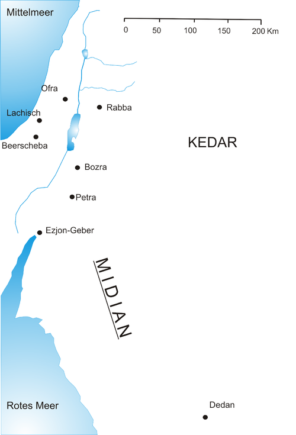

## Assumption

- There is no magic, no miracles, no gods.

## The Different Sources of Exodus

## Israel in Egypt

> And the children of Israel we fruitfil and teemed and multiplied and became very, very strong, and the land was filled with them. [E]
> — Exodus 1

> Come on, let us be wise with towards it [the children of Israel] or else it will increase; and it will be, when war happens, that it, too, will be added to our enemies and will war against us and go up from the land. [E]
> — Exodus 1:10

The Israelites were not slaves in the same sense as the slavery that took place in the United States; rather, they were a subservient tribe under the rule of the Pharaoh in a feudal system. The Israelites would own their own houses where they lived with their own families, but have duties to the Pharaoh.

## Moses' House

Exodus makes no secret of Moses' Egyptian heritage:

> And the boy grew older, and she brought him to Pharaoh's daughter, and he became her son. And she called his name Moses, and she said, "Because I drew him from the water." [J]
> — Exodus 2:10

In both Hebrew and Egyptian, Moses is spelled "mss". _Mss_ means "son" or "heir", which implies that _Moses_ alone could not have been his full name. For example, Ramses—spelled "rmss"—means "son/heir of Ra", and since it is spelled without vowels, _Ramses_ is just a valid name as _Ramoses_. The author of _J_ likely did not understand that Moses really was an Egyptian name, but attributed it to a word that sounded similar in Hebrew and tied it to the story. Even _if_ Moses was Hebrew, why would his adoptive, _Egyptian_ mother give him a Hebrew name?

_J_ and _E_ tells the story of how Moses was left in a basket in the Nile river, where he was found by the Pharaoh's daughter. But this story occurs in many other cultures—such as the story of Sargon of Akkad. It is unlikely that Moses was the origin of this story, and so we may consider it a construct to make Moses appear to be an Israelite, when in reality, he was an Egyptian. Would the Pharaoh not have noticed that his daughter never got pregnant, or questioned why she was suddenly raising a child of unknown origin?

> And Moses said to YHWH, "Please, my Lord, I am no man of words. Neither from yesterday nor from the day before—nor since you spoke to your servant. Because I am heavy of mouth and heavy of tongue." [E]
> — Exodus 4:10

Moses appeals to YHWH, stating that he is "heavy of mouth and heavy of tongue". By this, he means that he does not speak the Hebrew language. YHWH says:

> "Isn't Aaron your Levite brother? I knew that he will speak! And also here he is, coming out towards you! And he'll see you and be happy in his heart. And You'll speak to him and set and set the words in his mouth, and I, I shall be with your mouth and his mouth, and I shall instruct you what you shall do. And he will speak for you to the people. And he will be: he will become a mouth for you, and you will become a god for him." [E]
> — Exodus 4:14-16

A Levite is a member of the tribe of Levi—one of the twelve tribes of Israel. So Aaron, a Levite, will be Moses' mouthpiece to the Israelite people. This is a further indication that Moses does not speak Hebrew—he needs a translator.

Aaron in the Bible is also not Moses' literal brother, or YHWH would not have had to specify that he is a Levite. Moses, an Egyptian, would certainly not have any Israelite siblings. There is also this passage from Moses' dialogue with Jethro, before he leaves for Egypt, where he refers to the Israelites as his "brothers":

> And he [Moses] went back to Jether [Jethro], his father-in-law, and said to him, "Let me go so I may go back to my brothers who are in Egypt and see if they're still living".

> And Moses went, and Aaron, and they gathered all the elders of the children of Israel. [E]
> — Exodus 4:29

"Israel" is Jacob's alternative name. According to the Bible, Jacob had twelve sons, each of whom became the ancestor of a tribe (including Levi). So "the children" of Israel refers to the Israelite people.

> And Aaron spoke all the words that YHWH had spoken to Moses.
> — Exodus 4:30

See, Aaron is Moses' translator, and Mose's second in command. After this, they meet with Pharaoh to negotiate.

> And is was after those many days, and the king of Egypt died.
> — Exodus 2:23

If the throne passed down to the next son in line, this would mean that Moses was the nephew of the new Pharaoh—the Pharaoh that would rule during the Exodus.

The nobility was the warrior class, and so the Pharaoh would have been the highest ranking general, and used his adult male family members as officers. And sure enough, when Moses later leads the Israelites out of Egypt, he does so with an army:

> And the children of Israel went up armed from the land of Egypt. [E]
> — Exodus 13:18

As we will soon see, this army ransacks Egypt and defeats the Egyptian army in a pitched battle. But for our intents and purposes at this moment is for us to understand that Moses is of the warrior class.

## Moses' Alliance

Not much is said about Moses' time before marriage. The only thing we are told is that he murdered an Egyptian man and got found out:

> He turned this way and that way, and saw that there was no man, and he struck the Egyptian and hid him in the sand.
> And he went out on the second day, and here were two Hebrew men fighting, and he said to the one who was wrong, "Why would you strike your companion?"
> And he said, "Who made you a commander and a judge over us? Are you saying to kill me as you saying you'd kill me—the way you killed the Egyptian?!"
> And Moses was afraid, and he said, "The thing is known for sure." [J]
> — Exodus 2:12–14

If anything is to be believed in this episode, it is that Moses had a violent past.

Pharaoh soon finds out about the crime, which forces Moses to flee to the land of Midian:

> And Pharaoh heard this thing, and he sought to kill Moses. And Moses fled from Pharaoh, and he dwelt in the land of Midian. [J]
> — Exodus 2:15

The land of Midian lies to the east of the Sinai peninsula.

There, he meets a local priest named Jethro (or Reuel, depending on the source), whose daugher he marries. He must have spent a few years there, for she bears him a son, and the Pharaoh dies:

> And Moses was content to live with the man. And he gave Ziporah, his daughter, to Moses. And she bore him a son, and he called his name Gershom, because he said, "I was a stranger in a foreign land."
> And it was in those many days, and the king of Egypt died. [J]
> — Exodus 2:21–23

After the Exodus, Moses emerges on the Sinai peninsula, where he meets up with Jethro:

> And Jethro, Moses' father-in-law, and his sons and his wife came to Moses, to the wilderness in which he was encamped, at the Mountain of God. [E]
> — Exodus 18:5

Moses convinces his brother-in-law, Hobab, to join him in his journey to the promised land, which he intends to conquer.

> And Moses said to Hobab, the son of Reuel (Jethro) the Midianite, Moses' father-in-law, "We are journeying to the place that YHWH said, 'I will give it to you'. Come with us, and we will do good to you, because YHWH has spoken good regarding Israel."
> And he said to him, "I will not go, but I will go to my land and to my birthplace."
> And he said, "Don't leave us, because you know the way we should camp in the wildnerness, and you will be eyes for us. And it will be, if you go with us, that we will do good for you in proportion to the good that YHWH will do for us" [J]

Is Moses promising Hobab a share of the spoils of war?

The story of _J_ continues a few chapters later:

## The Ransacking of Egypt

The Egyptians were eager to see the Israelites leave:

> And Egypt was forceful on the people to hurry to let them go from the land, because they said, "We are all dead!" [E]
> — Exodus 12:33

Yet if we are to beleive the Bible, the Israelites did not leave empty-handed:

> And the children of Israel had done according to Moses' word, and they asked items of silver and gold and garments from Egypt.
> And YHWH gave the people favor in the eyes of Egypt, and they lent them, and they despoiled Egypt. [E]
> — Exodus 12:35–36

In _J_, YWYH had foretold the same:

> And I will put this people's favor in Egypt's eyes, and it will be that when you go, you will not go empty-handed.
> And each woman will ask for silver articles and gold articles and clothes from her neighbor and from anyone staying in her house, and you will put them on your sons and on your daughters, and you will despoil Egypt. [J]

If we do not believe in godly interventions, it seems implausible that the Egyptians would willingly "lend" their valuables to their former subjects. On the contrary, "despoil" means to plunder, loot, or take valuable things by force or deception.

In the Poem of the Battle of Kadesh, the Hittites are described to despoil their land to pay off foreign mercenaries:

> He left neither silver nor gold in his land, but despoiled it of all its possessions and gave to all foreign countries to bring them with him to combat. [E]

Sounds eerily similar to the Israelites despoiling Egypt, after which they leave the country with an army:

> And the children of Israel went up armed from the land of Egypt. [E]
> — Exodus 13:18

There can be no doubt about it: Moses brought an Army with the israelites. Contrary to modern depictions of the Exodus—according to Exodus— the Israelites did not leave Egypt as a ragtag group of slaves, but with armed men and a baggage train filled with spoils.

> And YHWH was going in from of them by day in a column of cloud to show them the way, and by night in a column of fire to shed light for them, so as to go by day and by night. [J]
> — Exodus 13:21

An contemporary army, marching through the desert, would have moved in a column, followed by a baggage train with civilians. During the day, the moving chariots and the marching soldiers will kick up a column of dust that will be visible from afar.

It sounds like the story is being told from the perspective of a camp follower—a non-combatant in the baggage train who interprets the sight of the great column of dust as a presence of a deity.

Sun Tzu made a similar observation of how enemy armies would kick up "columns" of dust:

> When there is dust rising in a high column, it is the sign of chariots advancing; when the dust is low, but spread over a wide area, it betokens the approach of infantry.
> — Sun Tzu, The Art of War, The Army on the March

Indeed, at the time of Exodus, armies consisted of chariots and infantry:

> And he [Pharaoh] hitched his chariot and took his people with him. And he took six hundred chosen chariots—and all the chariotry of Egypt—and officers over all of it.
> — Exodus 14:6

When the Pharaoh overtakes the Israelites, the "column of cloud"—the army—turns around to face the Egyptians:

> And the angel of God, who was going in from of the camp of Israel, moved and went behind them. [E]
> — Exodus 14:19

> And it came between the camp of Egypt and the camp of Israel. [J]
> — Exodus 14:20

The story is being told from the perspective of a non-combatant in the Israelite camp, watching the two armies face off against each other.

## The Battle of the Red Sea

We now have two armies facing each other, but how big were they, and how were they composed? The Exodus—if it happened—is believed to have taken place around 1200 BC, possibly during the long reign of Ramesses II (1279–1213 BC). As it so happens, there is a record of a battle that took place during the reign of Ramesses II—the Battle of Kadesh, 1274 BC—in which the Egyptian army battled the Hittites

> His Majesty journeyed northward, his infantry and his chariotry with him.

> (When) His Majesty went to look behind him, he found surrounding him 2,500 span (of chariotry) in his way out, consisting
> of evert warrior of the foemen of Hatti, together with the many countries which were with them: ...

> I shot to my right and grappled to my left. I was like Set in his time before them. I found the 2,500 spans of chariotry, in whose midst,I was,heaps of corpses before my horses.

— **John A. Wilson**, "The Texts of the Battle of Kadesh," _The American Journal of Semitic Languages and Literatures_ 43, no. 4 (Jul. 1927): 266-287.

The Poem describes how Ramesses II's engaged the foe with both chariotry and infantry, got surrounded by 2,500 hostile chariots which he defeated by using his bow with his right hand, while steering his chariot with the left hand.

Later in the battle, 1000 Hittite chariots charges the Egyptians:

> Their total was 1,000 spans of chariotry, which came straight on to the fire.

The battle of Kadesh is believed to be the biggest chariot battle in history. The accounts from the Poem of the Battle of Kadesh give us some idea of the size and composition of the Egyptian army at the time of the Exodus:

- The army was composed of chariots and infantry.
- The chariots could number up to around 2,500.
- The charioteers were armed with bows and arrows.
- However, according to Exodus 14:6, Pharaoh took only 600 chariots with him, which supposedly was all the chariotry of Egypt.

But what about the Israeli army? We already established that they didn't leave Egypt unarmed. Since the Egyptians chose to engage in battle with the Israelites, they must have had confidence in their ability to defeat them, which means that the Israelite army could not have been much stronger than the Egyptian army. At the same time, from the source of _J_, we know that the Israelites did persevere and routed the Egyptians, so it could not have been much weaker either.

We can disregard _E_'s numbers of the Israelites as being totally unrealistic:

> The men, apart of infants, were about six hundred thousand on foot.
> — Exodus 12:37

Surely, six hundred thousand infantry would have been able to defeat 600 chariots!

We have two contradictory accounts of how the Egyptians are defeated—one by lifting the sea with magic (_P_), the other by fighting a pitched battle (_J_):

> And Moses reached his hand over the sea [P]. And YHWH drove the sea with a strong east wind all night, and He made the sea into dry land [J]. And the waters was split [P].
> — Exodus 14:21

While _P_ describes Moses waving his staff and immediately "splitting" the sea, _J_ describes the sea retracting over the course of the _entire_ night—a tidal wave.

In the next two verses, _P_ proceeds by telling the classical tale of the sea parting, the Israelites crossing the Red Sea, and the Egyptians drowning.

On the other hand, _J_'s account describes a classical battle that takes place the following morning:

> And it was in the morning watch, and YHWH gazed at Egypt's camp through a column of fire and cloud, and threw Egypt's camp into tumult. [J]
> — Exodus 14:24

Again, YHWH is being attributed to the Israelite army, which defeats the Egyptians and pursues them:

> And Egypt said, "Let me flee from Israel, because YHWH is fighting for them against Egypt." [J]
> — Exodus 14:25

> And the sea went back to its strong flow toward morning, and Egypt was fleeting toward it, and YHWH tossed the Egyptians into the sea. [J]
> — Exodus 14:27

In _J_ , the Egyptians are driven _into_ the sea by the Israelites. Perhaps cornered against the sea, the Egyptian army—or parts of it—gets massacred.

> Pharaoh's chariots and his army He plunged into the sea, and the choice of his troops drowned in the Red Sea. [J]
> — Exodus 15:4

> Sing to YHWH for He Triumphed!
> Horse and its rider He threw into the sea.
> — Exodus 15:1

Note the wording of "plunged" and "threw".

After the battle, the Israelites cross the Sinai peninsula until they reach Canaan (present day Israel) where they are met by an army. This time, the battle is described in _E_ (not in _J_ or _P_):

> And Amalek came and fought with Israel in Rephidim. And Moses said to Joshua, "Choose men for us and go, fight against Amalek..." And Joshua did as Moses said to him, to fight against Amalek... And Joshua defeated Amalek and his people with the edge by the sword.

Here, YHWH is not mentioned as a combatant. Clearly, the Israelites are described as capable of fighting their own battles.

## Aftermath

> And Jethro, the priest of Midian, Moses' father-in-law, heard of all that God had done for Moses and for Israel, His people, that YHWH had brought Israel out from Egypt.
> — Exodus 18:1

> And Jethro, Moses' father-in-law, and his sons and his wife came to Moses, to the wilderness in which he was encamped, at the Mountain of God.
> — Exodus 18:5

> In the third month after the exodus of the children of Israel from the land of Egypt, on this day, they arrived at the wilderness of Sinai.

The wilderness of the Sinai peninsula were where Egypt ended.

## TODO

- [ ] What kind of people are the israelies? (Herders)

### Uncategorised

This has not been incorporated into the rest of the text yet:

> And I shall pass through the land of Egypt on this night, and I shall strike every firstborn in the land of Egypt, from human to animal, and I shall make judgments on all the gods of Egypt. I am YHWH.
> — Exodus 12:12

Interestingly, the gods of Egypt were considered real, competing gods.
